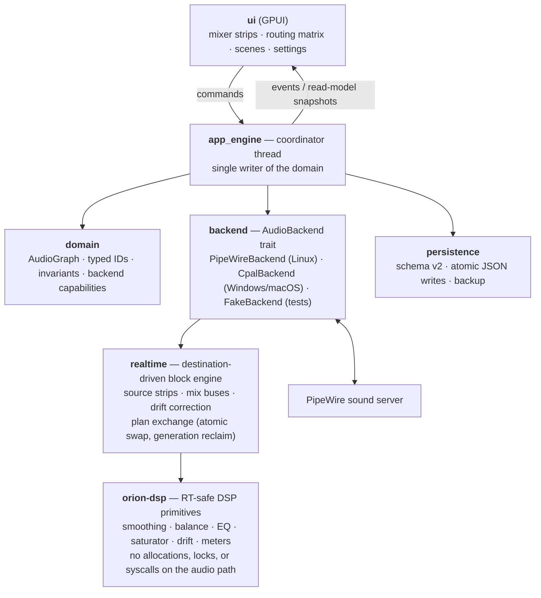

<div align="center">
  

  # Orion

  **Free software audio mixer and routing workspace for Linux, Windows, and macOS, built in Rust with GPUI.**

  [](https://github.com/gardun0/orion/actions/workflows/ci.yml)
  [](https://github.com/gardun0/orion/releases)
  [](https://aur.archlinux.org/packages/orion-bin)
  [](LICENSE)
</div>

---

Orion aims to be the audio control room of the desktop: one workspace where
physical microphones and interfaces, application streams, desktop audio, and
virtual devices are mixed, metered, and routed. PipeWire powers Linux (with
virtual devices and per-application routing); Windows (WASAPI) and macOS
(CoreAudio) run through a cpal backend driving the same real-time engine — and
the GPUI interface is native everywhere (Wayland and X11 on Linux).

Orion started as a personal project — built for my own audio setup — and is now
in active development. It is free software and will always be completely free
for everyone. Development is assisted by AI pair-programming via
[OpenCode](https://opencode.ai), using models such as GPT and Kimi; design,
review, and direction remain human.

## Status

Orion is at `0.x` (pre-release), and the mixer is live: devices are discovered
with hot-plug (and sleep/wake recovery), virtual inputs/outputs are created
automatically and managed from the UI, and routes carry real audio through the
real-time block engine — every destination bus is summed in-process, clock
drift between devices is corrected transparently, and an always-on saturator
protects each mix. Every channel has a fader, mute, sync delay, 3-band EQ, and
a click-free channel-mode switch; peak/RMS meters with clip indication, scenes
(which track the mixer live while selected), and settings persist across
restarts. Remaining work before `1.0` focuses on engine telemetry (latency and
XRuns; CPU load is already in the footer), gaming EQ presets, and validating
the macOS/Windows backends that now compile and package in CI — see the
[feature tables](#features).

## Features

### Implemented

| | |
|---|---|
|  | **Live mixing console** — physical, application, desktop, and virtual source strips routed to physical (`A`) and virtual (`B`) output buses, each bus summed sample-accurately in the real-time block engine |
|  | **Channel controls** — interactive faders (-60…+10 dB, Shift for fine adjust, double-click to reset), per-strip mute, and master mute |
|  | **Per-channel EQ & delay** — a 3-band EQ (low shelf / mid bell / high shelf, ±12 dB) and a sync delay knob (0–500 ms) on every source and output, live in the real-time path |
|  | **Channel modes** — Auto, Stereo, Mono, Left, Right, and Swap per channel, switched click-free with a short crossfade in the real-time path |
|  | **Routing** — per-strip route buttons and a routing matrix, both driving live PipeWire route streams; routing intent survives device sleep, hot-plug, and rebinding, and self-heals if a route stalls |
|  | **Virtual devices** — virtual inputs that receive audio from applications and virtual outputs that applications can use as microphones; created automatically and managed from the UI |
|   | **Endpoint discovery** — PipeWire sources and sinks, default device tracking, and hot-plug updates |
|  | **Live meters** — elastic per-channel L/R meters (−90…0 dB with peak-hold marks and RMS markers) fed by the real-time engine, a per-strip clip LED, plus process CPU load in the footer |
|  | **Clipping protection** — an always-on soft-knee saturator (−1 dBFS knee) bounds every bus post-mix; clip detection runs pre-saturator, so driving a bus stays visible on the meter |
|  | **Scenes & settings** — scenes track the mixer live while selected; everything persists to `settings.json` (schema v2) with atomic autosave, live reload on external edits, import/export, and a published JSON Schema ([`schema/settings.schema.json`](schema/settings.schema.json)) |
|  | **Native desktop app** — GPUI interface on Linux (Wayland and X11), Windows, and macOS, with embedded fonts and icons and no runtime asset dependencies |

### In development

| | |
|---|---|
|  | **Engine telemetry** — latency and XRun stats (CPU load and live level meters already work) |
|  | **EQ presets for gaming** — named profiles tuned for titles like Warzone and CS2, built on the 3-band EQ that already works per endpoint |
|  | **macOS & Windows validation** — a cpal-based backend drives the same real-time engine on both OSes; CI compiles, tests, and packages all three platforms (zip on Windows, unsigned `.app` on macOS); runtime validation and signed installers come next |

Have an idea that's not on the list?
[Open an issue](https://github.com/gardun0/orion/issues) — feature requests and
audio-workflow suggestions are welcome.

## Architecture

Orion is a Cargo workspace with a strict separation between presentation,
control, audio backend, and real-time DSP:



Execution model: the GPUI thread renders and sends commands; the coordinator
owns the authoritative `AudioGraph`; the backend thread owns the PipeWire main
loop and stream lifecycle; the persistence worker serializes state with atomic
writes and backups. The real-time engine runs inside the audio callbacks: one
capture engine per source endpoint and one mix bus per destination, linked by
pre-allocated rings with adaptive drift correction between device clocks.
Structural changes travel as immutable plans swapped atomically and reclaimed
by generation, so the audio path provably never allocates (enforced by a
counting-allocator test), locks, logs, or syscalls.

### Project layout

```text
Cargo.toml              workspace root + `orion` package and packaging metadata
crates/orion-dsp/       RT-safe DSP crate (no GPUI/PipeWire dependencies)
src/
  main.rs               binary entry point: window, identity, fonts, icon
  lib.rs                library: app_engine, backend, domain, persistence
  process_stats.rs      process CPU sampling for the footer readout
  app_engine/           engine coordinator thread, command/event routing
  backend/              AudioBackend trait, PipeWire backend, cpal backend
                        (Windows/macOS), fake backend
  realtime/             platform-neutral block engine: source/bus engines,
                        plan exchange, meters (no GPUI/PipeWire dependencies)
  domain/               AudioGraph, typed IDs, controls, events, errors
  persistence/          settings schema, atomic writes with backup, file watch
  state.rs              session model driving the interface
  ui/                   GPUI views: channel strips, routing matrix, header/footer
  assets.rs             embedded icons/fonts via GPUI AssetSource
assets/
  app-icon/             application icon (SVG + PNG sizes)
  fonts/                Inter and JetBrains Mono (SIL OFL 1.1)
  icons/                UI icon set (see Attribution)
  docs/                 colored icon copies used by this README
  linux/                desktop entry and AppStream metainfo
packaging/
  appimage/             AppImage build script (linuxdeploy)
  aur/                  PKGBUILD template for the orion-bin AUR package
  macos/                unsigned Orion.app bundle script and Info.plist
tests/                  live-PipeWire integration tests (ignored by default)
                        plus the engine's realtime-contract audit
schema/                 canonical settings JSON Schema (published for external use)
```

## Installing

Pre-built packages are attached to every
[GitHub Release](https://github.com/gardun0/orion/releases):

- **Debian/Ubuntu** — `sudo apt install ./orion_<version>_amd64.deb`
- **Fedora/openSUSE** — `sudo dnf install orion-<version>-1.x86_64.rpm`
- **Arch Linux (AUR)** — `yay -S orion-bin` or `paru -S orion-bin`
- **AppImage** — `chmod +x orion-v<version>-x86_64.AppImage && ./orion-v<version>-x86_64.AppImage`
- **Tarball** — extract and copy `orion` into your `PATH`; the desktop file,
  icons, and AppStream metadata are included under their conventional names
- **Windows** — extract `orion-v<version>-x86_64-pc-windows-msvc.zip` and run
  `orion.exe`
- **macOS (Apple Silicon)** — extract `orion-v<version>-aarch64-apple-darwin.zip`;
  the `.app` is unsigned, so on first launch use right-click → Open (Gatekeeper)

All artifacts ship with `SHA256SUMS.txt` for verification. The Windows and
macOS builds are compiled and tested in CI but not yet runtime-validated —
expect rough edges and please report them.

## Building

Orion builds with stable Rust (see `rust-toolchain.toml`) on Linux, Windows,
and macOS. The Windows and macOS builds need no audio system dependencies —
WASAPI and CoreAudio are reached through cpal — only the platform's standard
toolchain (MSVC on Windows, Xcode Command Line Tools on macOS). On Linux the
linker is configured as `clang` + `mold` (`.cargo/config.toml`).

System dependencies (Linux):

```sh
# Debian/Ubuntu
sudo apt install clang mold pkg-config cmake \
  libasound2-dev libfontconfig-dev libwayland-dev \
  libx11-xcb-dev libxcb-xkb-dev libxkbcommon-dev libxkbcommon-x11-dev \
  libpipewire-0.3-dev libspa-0.2-dev libclang-dev libssl-dev

# Fedora
sudo dnf install clang mold pkgconf cmake \
  alsa-lib-devel fontconfig-devel wayland-devel \
  libX11-devel libxcb-devel libxkbcommon-devel libxkbcommon-x11-devel \
  pipewire-devel clang-devel openssl-devel

# Arch
sudo pacman -S clang mold pkgconf cmake \
  alsa-lib fontconfig wayland libxcb libx11 libxkbcommon libxkbcommon-x11 \
  pipewire
```

Then:

```sh
cargo build --locked
```

## Running

```sh
cargo run --locked
```

Orion opens at `1440x860` with a minimum window size of `1100x680`. Set
`RUST_LOG` (for example `RUST_LOG=orion=debug,warn`) to control logging.

## Development

Every change must pass the same gates as CI:

```sh
cargo fmt --all --check
cargo clippy --workspace --all-targets --locked -- -D warnings
cargo check --workspace --all-targets --locked
cargo test --workspace --locked
```

The integration tests in `tests/pipewire_backend.rs` require a live PipeWire
session and are ignored by default; run them manually with
`cargo test -- --ignored`.

Commits follow [Conventional Commits](https://www.conventionalcommits.org)
(enforced by commitlint on pull requests). Releases are automated with
[release-please](https://github.com/googleapis/release-please): merging its
release PR on `main` tags `vX.Y.Z`, builds the tarball, `.deb`, `.rpm`, and
AppImage, publishes the GitHub Release, and updates the
[`orion-bin` AUR package](https://aur.archlinux.org/packages/orion-bin).

## Attribution

- **Fonts** — [Inter](https://rsms.me/inter/) (Rasmus Andersson) and
  [JetBrains Mono](https://www.jetbrains.com/lp/mono/) (JetBrains), both under
  the SIL Open Font License 1.1; license texts ship in `assets/fonts/`.
- **Icons** — via [Iconify](https://iconify.design/):
  [CoreUI Free](https://github.com/coreui/coreui-icons) by creativeLabs
  Łukasz Holeczek (CC BY 4.0), [Siemens Industrial
  Experience](https://github.com/siemens/ix-icons) (MIT), [Eva
  Icons](https://github.com/akveo/eva-icons) by Akveo (MIT),
  [Hugeicons](https://hugeicons.com/) (MIT), and
  [TDesign Icons](https://github.com/Tencent/tdesign-icons) (MIT).

## License

Orion is licensed under the GNU General Public License v3.0 — it is, and will
always be, completely free for everyone: no paid tiers, no locked features. See
[`LICENSE`](LICENSE).
